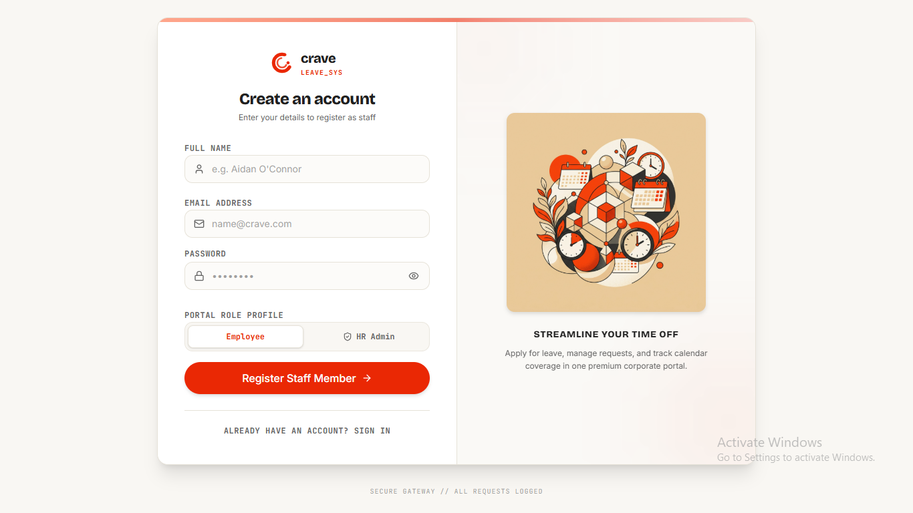
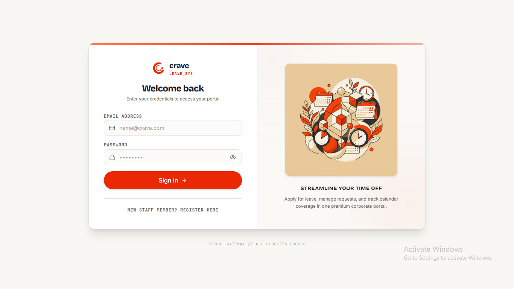
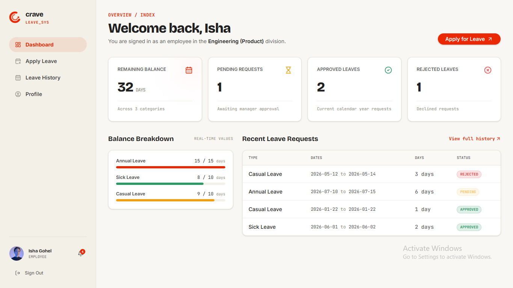
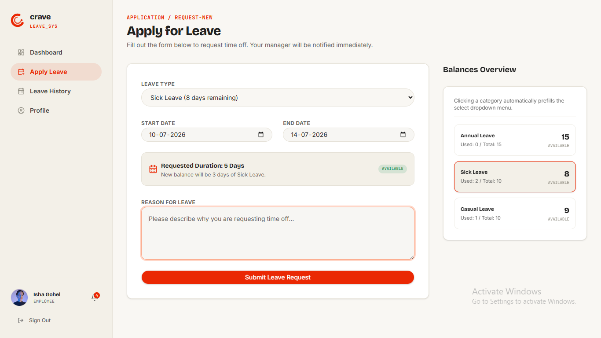
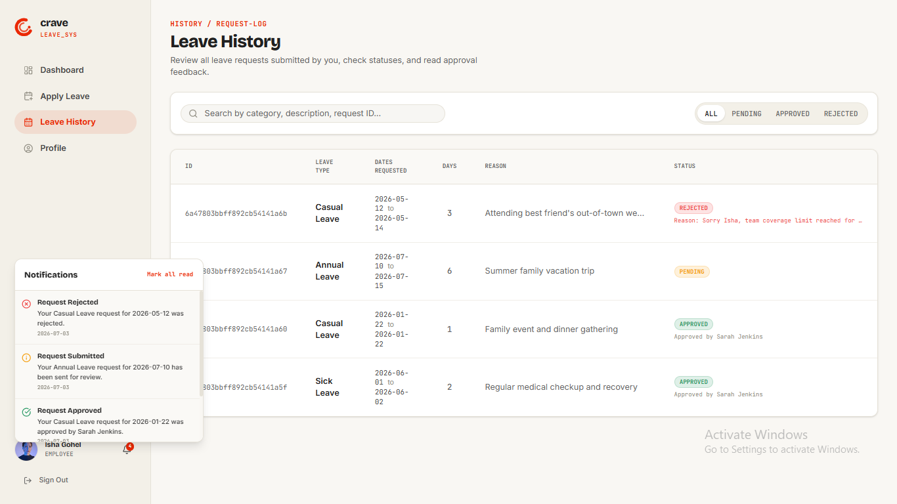
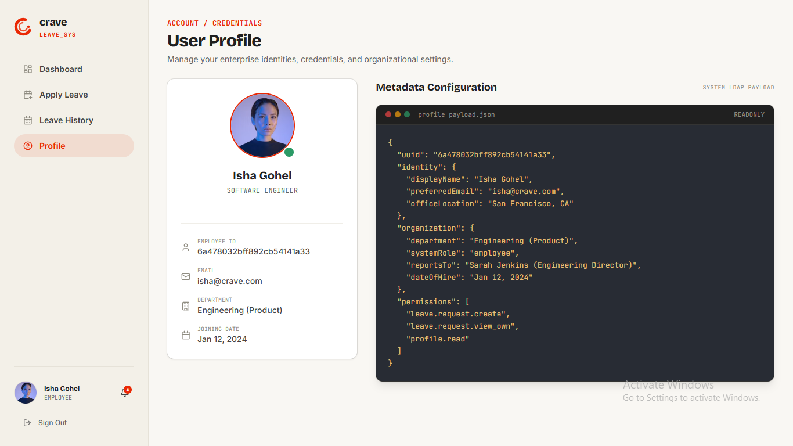
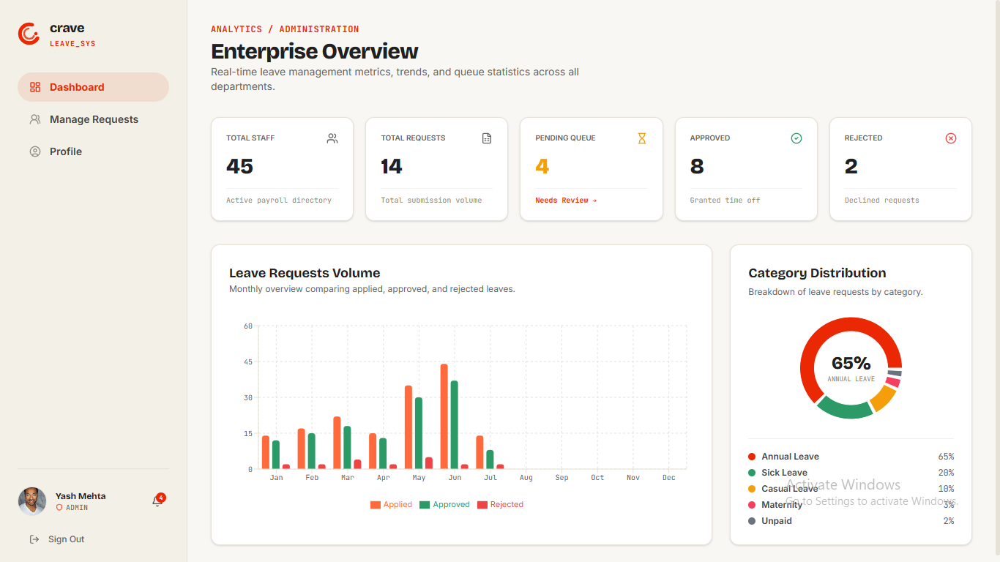
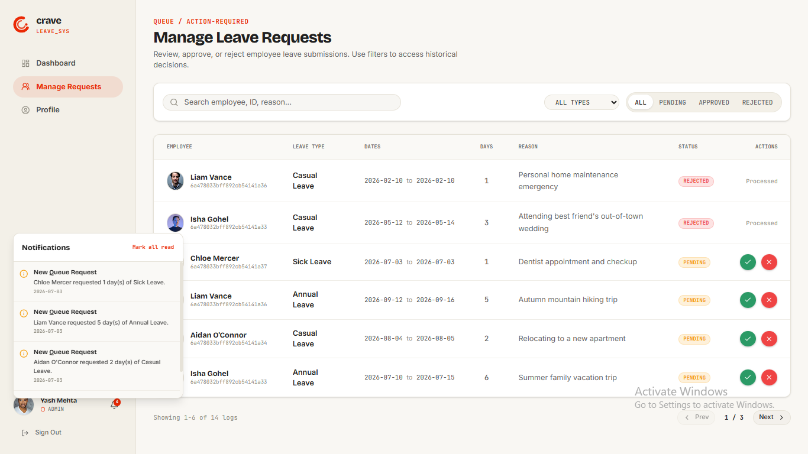
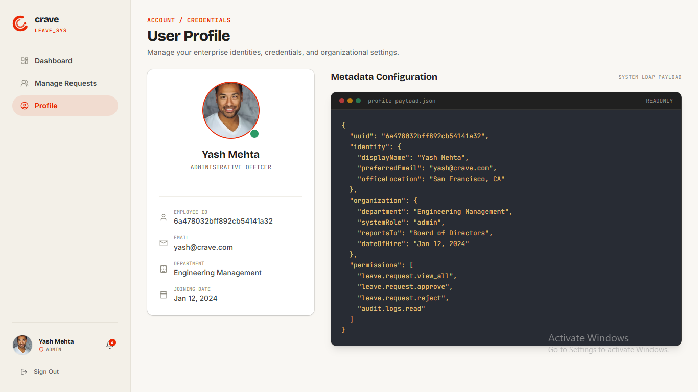

# Crave Leave Management System
### NROLLED – IT Team Selection Assignment (Option 1)

Crave Leave is a modern, responsive, and feature-rich leave tracking portal built to streamline employee leave applications and admin approval workflows. This system features real-time notifications, personal dashboards, and a premium split-screen responsive user interface.

---

## 🚀 Tech Stack

### Frontend
- **Framework**: React.js (Vite compiler)
- **Styling**: Tailwind CSS v4 (Custom theme & variables configuration)
- **Animations**: Framer Motion (Page transitions, card transitions, drawer slides)
- **Icons**: Lucide React
- **Toast Engine**: Sonner (Interactive popups)
- **UI Base**: Headless Radix / Shadcn components (Dialog modals, badges, inputs, textareas)

### Backend
- **Runtime**: Node.js & Express
- **Database**: MongoDB (Mongoose ODM)
- **Authentication**: JWT (JSON Web Tokens) with custom role-based middleware
- **Process Manager**: Nodemon (Hot-reload)

---

## 🎨 Key Features & Functional Modules

### 1. Authentication & Role-Based Access
- Secure registration and login gateways.
- Toggle between **Employee** and **HR Admin** roles during account creation.
- Modern responsive split-screen login page with a centered form and brand vector artwork.

### 2. Employee Portal
- **Dashboard**: High-level overview of leave balances (Annual, Casual, Sick leaves), pending requests, and upcoming breaks.
- **Apply for Leave**: Simple form with leave type dropdown, date inputs, and text explanation area.
- **Leave History**: Filterable list of all previous applications, search bar with real-time text matching, and paginated request lists.

### 3. HR Admin Portal
- **Dashboard**: Unified metrics (Total users, active pending queue, processed approvals, and rejects).
- **Manage Requests**: Table of all employee leave submissions. Admin can approve or reject.
- **Rejection Modals**: Prompting the admin to provide release schedule conflicts or coverage gap reasons before rejecting.
- **Leave History**: Comprehensive historical log of all team actions.

### 4. Interactive Notifications
- Integrated sidebar-bound notifications bell.
- Unread counter, real-time message popups, and a "Mark all as read" control.

---

## 📸 Screenshots

### 🔑 Authentication
| Registration Page | Login Page |
| :---: | :---: |
|  |  |

### 👤 Employee Portal
| Employee Dashboard | Apply for Leave |
| :---: | :---: |
|  |  |

| Leave History | Employee Profile |
| :---: | :---: |
|  |  |

### 👑 HR Admin Portal
| Admin Dashboard | Manage Requests |
| :---: | :---: |
|  |  |

| Admin Profile |
| :---: |
|  |

---

## 🏗️ System Architecture

```mermaid
graph LR
    Frontend[React + Vite (Frontend)] <-->|REST API + JWT Auth| Backend[Node + Express (Backend)]
    Backend <--> Database[(MongoDB Database)]
```

---

## ⚙️ Installation & Local Setup

### Prerequisites
- **Node.js** (v16+)
- **MongoDB** (Running locally on `mongodb://127.0.0.1:27017` or a cloud MongoDB Atlas URI)

### Step 1: Database Setup
Make sure MongoDB is running locally:
```bash
# On Windows, start MongoDB Service if not running
net start MongoDB
```

### Step 2: Backend Setup
1. Navigate to the backend directory:
   ```bash
   cd backend
   ```
2. Install server dependencies:
   ```bash
   npm install
   ```
3. Set up environment variables. Create a `.env` file in the `backend` folder:
   ```env
   PORT=5000
   MONGO_URI=mongodb://127.0.0.1:27017/leave_management
   JWT_SECRET=your_jwt_secret
   ```
4. Start the backend server:
   ```bash
   npm run dev
   ```

### Step 3: Frontend Setup
1. Open a new terminal window and navigate to the frontend directory:
   ```bash
   cd frontend
   ```
2. Install client dependencies:
   ```bash
   npm install
   ```
3. Start the Vite local server:
   ```bash
   npm run dev
   ```
4. Open your browser and navigate to `http://localhost:5173`.

---

## 🤖 AI Usage Report

AI tools were used as development assistants throughout the project to improve productivity, accelerate debugging, and refine the user experience.

### AI-Assisted Tasks
* **UI & UX Improvements**
  - Improved layout structure and responsiveness.
  - Refined spacing, alignment, and component hierarchy.
  - Enhanced dashboard and authentication page design.
* **Debugging & Problem Solving**
  - Resolved Tailwind CSS styling conflicts.
  - Fixed component rendering and state management issues.
  - Assisted in troubleshooting API integration problems.
* **Development Support**
  - Suggested cleaner component organization.
  - Helped optimize React and Express workflows.
  - Assisted in implementing role-based authentication logic.
* **Asset & Branding Support**
  - Assisted in generating visual assets and branding elements.
  - Helped create and refine the custom application identity.

---

## 📋 Assumptions
- Every user is assigned a default leave balance during registration.
- Leave balances are deducted only after approval.
- One user can have either Employee or Admin role.
- JWT tokens are stored in `localStorage`.
- Authentication is handled using Bearer tokens.
- MongoDB is used as the primary database.

---

## 🧩 Challenges Faced
- Designing secure role-based access control.
- Managing leave balances after approval workflows.
- Maintaining synchronization between dashboards and leave history.
- Creating a responsive UI across desktop and mobile devices.
- Handling Tailwind CSS v4 styling conflicts and overrides.

---

## 🚀 Future Improvements
- Email notifications
- Calendar integration
- Multi-level approval workflow
- Team leave calendar
- Analytics and reporting dashboard
- Export leave reports to PDF/Excel
- Role management system
